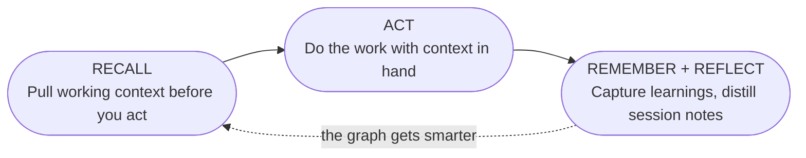

# Working with AI Agents

This guide is for **you**, the human working with AI agents. It explains how to set up your
environment, communicate effectively with agents, and use Sibyl to make every session more
productive than the last.

## The Core Insight

The memory you generate while working becomes someone else's asset, locked inside whichever tool you
happened to use. What you teach one agent, the next one never sees, so the same hard-won context
keeps dying between tools:

- The OAuth gotcha you figured out yesterday
- The pattern that finally made your tests pass
- The architectural decision that took hours to reach

**Sibyl fixes this.** It gives your agents one shared knowledge graph that stays yours, so what you
teach one tool every tool keeps. When you set things up correctly, your agent starts every session
with the context you already own instead of rebuilding it.

## Setting Up Your Environment

### 1. Install Skills

Skills teach your agent HOW to use Sibyl. The installed skill is a tiny pointer, and the CLI serves
the full markdown guidance for the installed version.

```bash
sibyl skill install
sibyl skill get core
```

Hooks inject context automatically, but they execute on session and prompt events. Add them only
when you explicitly want that behavior.

### 2. Configure Your CLAUDE.md

Your project's `CLAUDE.md` is the most important file for agent collaboration. It's the first thing
your agent reads. Use it to establish the Sibyl workflow.

**Essential sections:**

```markdown
# Project Name

## Sibyl Integration

**This project uses Sibyl for persistent memory.**

### Session Start (MANDATORY)

Run `/sibyl` at the start of every session. This loads:

- Current task context
- Relevant patterns and learnings
- Project-specific knowledge

### The Memory Loop

1. **Recall first**: Pull working context before implementing
2. **Act**: Track work in a task so progress survives the session
3. **Remember**: Capture non-obvious discoveries as durable memory
4. **Reflect**: Distill session notes into reviewable candidates
```

See [Setting Up Prompts](./setting-up-prompts.md) for a complete template.

### 3. Configure MCP (Optional)

For direct tool access, add Sibyl to your MCP configuration:

```json
{
  "mcpServers": {
    "sibyl": {
      "type": "http",
      "url": "http://localhost:3334/mcp"
    }
  }
}
```

The CLI is preferred for most operations. It uses fewer tokens and is more expressive.

## The Memory Loop

Every effective session follows the same cycle: **recall, act, remember, reflect.**



See [The Memory Loop](./memory-loop.md) for the cycle in depth.

## Talking to Your Agent

### Starting a Session

When you begin a new Claude Code session:

```
/sibyl
```

This single command teaches your agent the full Sibyl workflow. The agent will then:

1. Check for active tasks
2. Load relevant project context
3. Be ready to search before implementing

### Prompting for Research

Before implementing anything, ask your agent to research:

```
"Search sibyl for authentication patterns before we implement"

"Check if we've dealt with Redis connection issues before"

"Look for any existing patterns around rate limiting"
```

### Prompting for Task Work

Keep work organized with tasks:

```
"Create a task for implementing user authentication"

"Start the OAuth task"

"Update the task with notes about the redirect issue we found"

"Complete the task with learnings about state parameter security"
```

### Prompting for Knowledge Capture

When you discover something non-obvious:

```
"Add this to sibyl - the redirect URI must match exactly including trailing slash"

"Capture a pattern for this retry-with-backoff approach"

"Add an episode about the Redis WRONGTYPE error we debugged"
```

### Key Phrases That Work

| When You Want To...       | Say...                                      |
| ------------------------- | ------------------------------------------- |
| Recall working context    | "Recall context for X before we start"      |
| Search for patterns       | "Search sibyl for X"                        |
| Check task status         | "What tasks are in progress?"               |
| Start a task              | "Start the X task"                          |
| Capture a learning        | "Add this to sibyl: ..."                    |
| Complete with context     | "Complete the task with learnings about..." |
| Find related knowledge    | "Explore related patterns for X"            |
| Check project context     | "What do we know about this project?"       |
| Review recent discoveries | "What have we learned recently about X?"    |
| Block on dependency       | "Block this task - waiting on API team"     |
| Create a project          | "Create a project for the new feature"      |

## What to Capture

Not everything belongs in the knowledge graph. Focus on signal, not noise.

### Always Capture

- **Non-obvious solutions**: If it took time to figure out, save it
- **Gotchas and quirks**: Configuration issues, platform differences
- **Architectural decisions**: Why you chose approach A over B
- **Error patterns**: Problems and their root causes

### Consider Capturing

- **Useful patterns**: Reusable code structures
- **Performance findings**: What made things faster
- **Integration approaches**: How to connect systems

### Skip

- **Trivial info**: Things obvious from documentation
- **Temporary hacks**: Quick fixes that should be replaced
- **Well-documented basics**: Standard library usage

## Quality Bar

The knowledge graph gets smarter with every entry, but only if entries are high quality.

**Bad entry:**

> "Fixed the auth bug"

**Good entry:**

> "JWT refresh tokens fail silently when Redis TTL expires. Root cause: token service doesn't handle
> WRONGTYPE error. Fix: Add try/except with token regeneration fallback. Prevention: Always handle
> Redis type mismatches in token renewal logic."

The good entry includes:

- **What happened**: JWT refresh tokens fail silently
- **Root cause**: WRONGTYPE error not handled
- **Fix**: Try/except with fallback
- **Prevention**: General principle to apply

## Multi-Session Continuity

Sibyl shines across sessions. Here's how to maintain continuity:

### Before Ending a Session

If work is incomplete:

```
"Block the task with notes about what we were working on"

"Update task notes with current progress and next steps"
```

### Starting a New Session

```
/sibyl

"Check what tasks were in progress"

"Search for any recent learnings about OAuth"
```

The agent will pick up where you left off, with full context from previous sessions.

## Working with Multiple Agents

If you use multiple agents (different sessions, different projects):

### Knowledge Sharing

All agents share the same graph. Agent A's discoveries are immediately available to Agent B:

```
Agent A: Completes OAuth task with learnings about redirect URIs
Agent B: Searches "OAuth" and finds Agent A's insights
```

### Task Coordination

Use task status to prevent conflicts:

```
Agent A: "Start the frontend auth task"
Agent B: "Check what tasks are in progress" → sees Agent A is on frontend
Agent B: "Start the backend auth task"
```

### Leave Breadcrumbs

Help future sessions (and other agents) by documenting state:

```
"Add a session summary before we wrap up"
```

## Troubleshooting

### Agent Isn't Using Sibyl

1. Did you run `/sibyl` at session start?
2. Is your agent configured from the Connect page?
3. Is the server running? (`sibyl health`)

### No Results from Searches

1. Check you're in the right project context
2. Try broader search terms
3. Verify knowledge was actually captured in previous sessions

### Agent Forgot Previous Context

1. Search explicitly: "Search sibyl for what we worked on yesterday"
2. Check task history: "List completed tasks from the past week"
3. The knowledge is there. Help the agent find it

### Knowledge Quality Is Low

1. Be specific when capturing: give context, cause, fix, and prevention
2. Review and upgrade episodes to patterns when they prove useful
3. Add categories and tags for better searchability

## Example Session

Here's a complete session flow:

```
You: /sibyl

Agent: [Loads skill, checks context]
       Active project: proj_auth
       In-progress task: task_oauth - Implement OAuth login

You: Let's continue with the OAuth task. Search for any existing patterns first.

Agent: [Searches sibyl]
       Found: pattern_oauth_callback - "OAuth callbacks require exact URI matching"
       Found: episode_redis_state - "Store OAuth state in Redis with 5min TTL"

You: Good context. The callback handler is throwing a 400 error.

Agent: [Investigates, finds issue]
       The redirect URI is missing a trailing slash. Based on the
       pattern, URIs must match exactly.

You: That's it! Add this as a learning and complete the task.

Agent: [Captures learning]
       Added: "OAuth redirect URI trailing slash requirement"

       [Completes task]
       Completed task_oauth with learnings:
       "Redirect URIs must match exactly including trailing slashes.
        Google silently returns 400 if they don't match."
```

## Next Steps

- [The Memory Loop](./memory-loop.md) - The cycle in depth
- [Setting Up Prompts](./setting-up-prompts.md) - Complete CLAUDE.md template
- [Skills & Hooks](./skills.md) - Learn about the skill system
- [Task Management](./task-management.md) - Full task workflow
- [Capturing Knowledge](./capturing-knowledge.md) - What to save
