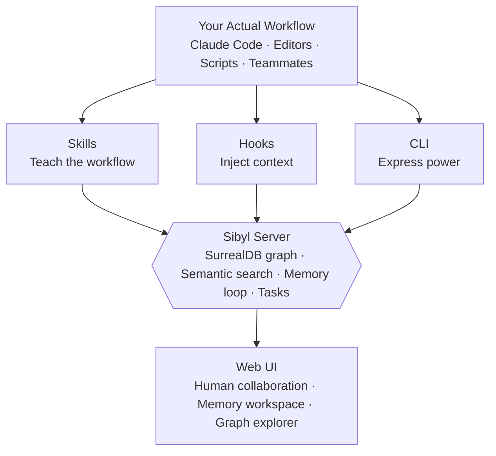
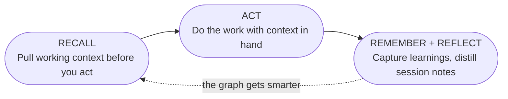

## The Problem

Every time you start a new coding session, critical context slips away. That OAuth gotcha you
debugged for two hours? Gone. The pattern that finally made your tests pass? Vanished. The
configuration quirk that took forever to figure out? Lost to the void.

## The Solution

Sibyl is **cross-agent memory**. A knowledge graph, memory loop, and task workflow shared across
every coding agent you use:

- **Memory:** Store patterns, decisions, and solutions that persist across sessions
- **The Memory Loop:** `recall → act → remember → reflect`, built into every surface
- **Task Tracking:** Manage work across sessions with full lifecycle support
- **Semantic Search:** Find knowledge by meaning, not exact keywords
- **Synthesis:** Generate verified documents grounded in your own memory
- **Source Ingestion:** Crawl external docs and import sources into one graph

## How It Works



### Skills + Hooks

**Skills** teach your tools and teammates structured workflows:

```bash
# Recall context before implementing
sibyl recall "authentication work" --intent build

# Track work with full lifecycle
sibyl task start task_xyz

# Capture learnings when done
sibyl task complete task_xyz --learnings "OAuth tokens need refresh..."
```

**Hooks** automatically inject relevant knowledge into every prompt so useful context shows up
before you have to go looking for it.

### For Humans: Web UI + CLI

**Web UI** for collaboration and oversight:

- Visual knowledge graph exploration
- Project and task management
- The memory workspace: captures, imports, and synthesis
- Document source configuration
- Team-wide dashboards

**CLI** for power users and scripting:

- The full memory loop from the terminal
- Semantic search and graph navigation
- Task lifecycle management
- Source crawling and ingestion

## Quick Start

```bash
# Start a local daemon
sibyl init --local
sibyl serve

# Capture a learning
sibyl remember "Redis insight" "Pool size must be >= concurrent requests" --kind pattern

# Recall it as working context
sibyl recall "redis connection pool"

# Manage tasks
sibyl task list --status doing
sibyl task complete <task_id> --learnings "OAuth tokens expire after 1 hour"
```

## The Memory Loop

Sibyl is built around a durable cycle that both humans and agents follow:



Every completed task makes your knowledge graph smarter. Every pattern discovered helps future
sessions move faster. **The system learns as you work.**

## Why Sibyl?

| Without Sibyl                    | With Sibyl                                |
| -------------------------------- | ----------------------------------------- |
| Agent rediscovers same solutions | Agent recalls existing patterns instantly |
| Context lost between sessions    | Knowledge persists in a graph             |
| Manual prompting required        | Hooks inject context automatically        |
| No task tracking                 | Full lifecycle with learnings capture     |
| Scattered documentation          | Searchable, connected knowledge graph     |

## Get Started

1. **[Installation](./guide/installation)** Set up Sibyl in five minutes
2. **[Quick Start](./guide/quick-start)** Your first knowledge graph session
3. **[Skills & Hooks](./guide/skills)** Teach your tools and teammates the workflow
4. **[Capturing Knowledge](./guide/capturing-knowledge)** Use the memory loop well

---

<p style="text-align: center; opacity: 0.7; margin-top: 3rem;">
Built for projects that deserve to remember.
</p>
